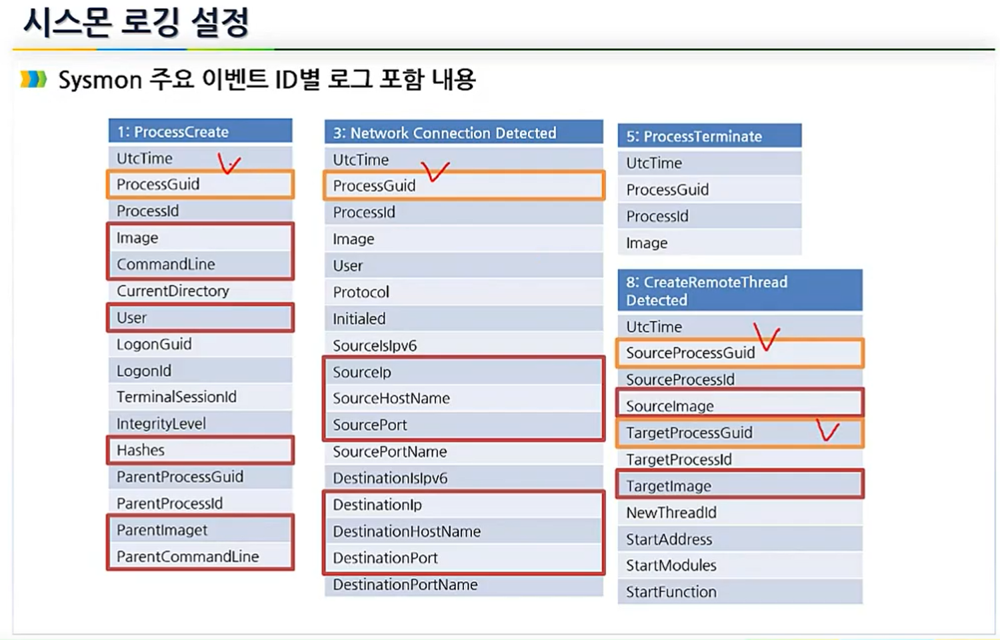

# 섹션4. 윈도우 로그 강화
1) Sysmon을 활용한 윈도우 침해사고 준비도
2) 강화된 윈도우 로그 분석 실습

(1)	시스몬 소개와 설치
Sysmon(시스템 모니터)란?
-	Windows 시스템 서비스 및 장치 드라이버
-	시스템에 설치되면 시스템 재부팅 시에도 상주하여 시스템 활동을 모니터링
-	Windows 이벤트 로그에 기록
프로세스 생성, 네트워크 연결 및 파일 생성 시간변경에 대한 자세한 정보 제공
-	Windows Event Collection 또는 SIEM 에이전트를 사용하여 생성한 이벤트를 수집과 분석 가능(악성 또는 비정상적인 활동을 식별하고 침입자 및 악성 프로그램의 네트워크 동작 이해)
-	Sysmon은 생성되는 이벤트의 분석을 제공하지 않음
-	공격자로부터 자신을 보호하거나 숨기지 않음

사고 대응 필요성 계층 구조
-	비즈니스 자산 보호
사고 대응 중에는 비즈니스 자산을 보호하기 위해 상대방과 동일한 템포를 사용 
-	멀웨어 유사 침입 감지 (sysmon이 하는 일)
레드 팀이 실제 적을 모방할 때, 나는 사살 사슬을 따라 여러 지점에서 그들의 침입을 탐지
-	이상 행위 감지 (sysmon이 하는 일): 여기가 탄탄해야 위 구조가 탄탄하다
모범 사례를 따르지 않는 위생 문제 및 운영자 활동을 감지

왜 sysmon이 필요할까?
- 전통적인 도구들로 탐지되지 않는 멀웨어 공격존재
- 부가적인 파일들의 해시를 남기기 어려움
- 윈도우 이벤트 수집환경으로 쉽게 통합가능
- 프로세스 생성과 네트워크 연결을 연관 짓기 어려움
- 스레드 인젝션, 드라이버 로드 등의 탐지가 어려움
- 솔루션 비용
- 기존에 해결하기 어려운 위에 있는 모든 과제들을 sysmon 하나로 해결!
-> 시스몬은 내부적으로 해시를 남길 수 있는 능력이 있다.    
악성코드들은 해시가 등록되어 있어서 알려져 있는 악성코드들은 해시를 통해 방어할 수 있다.

## 시스몬 아키텍쳐  
   

## sysmon 특징
-	전체 명령 줄을 사용하여 프로세스 생성을 기록
-	SHA1(기본값), MD5, SHA456 또는 IMPHASH를 사용하여 프로세스 이미지 파일 해시 기록
(동시에 여러 개의 해시를 사용)
-	윈도우에서 프로세스 ID를 다시 사용하는 경우에도 이벤트를 연계시키도록 프로세스 만들기 이벤트에 프로세스 GUID 기록
-	드라이버 또는 DLL의 로딩을 해당 서명과 해시로 기록
-	디스크 및 볼륨의 원시 읽기 권한을 얻는 경우 기록
-	선택적으로 각 세션의 소스 프로세스, IP 주소, 포트번호, 호스트 이름 및 포트 이름의 네트워크 연결을 기록
-	파일 생성 시간의 변화를 감지하여 파일이 실제로 생성된 시기 파악
(파일 생성 타임 스탬프 수정은 멀웨어가 트랙을 덮기 위해 일반적으로 사용)
-	레지스트리에서 변경된 경우 자동으로 구성을 다시 로드
-	특정 이벤트를 동적으로 포함시키거나 제외시키는 필터링 룰 사용 가능
-	부팅 프로세스 초기부터 정교한 커널모드 악성 프로그램에 의한 활동을 캡쳐하는 이벤트

## Sysmon 로깅 정보 예시
   
Command line에 인자로 전달된 것도 다 볼 수 있다.    
Guid는 남아있어서 그대로 사용가능하다.  
hash 값을 기록한다.   
   

## 시스몬 소개와 설치
- 기본 설정으로 설치하기
    

- 네트워크 기능 설치하기
     
이벤트에 안 보이던 3번이 보이기 시작했다.
3번은 네트워크 관련 이벤트 (Network connection detected)

- 기본 설정으로 설치한 뒤 설정 파일 덤프하기    
     
Sysmon64.exe -c -- : 기본설정으로 변경한 명령어

    
위의 화면은 현재 구성환경이다.
disabled인 이유는 너무 많아서이다.    
선택적으로 필터링해야되니깐 제작자가 이런 것들은 사용자가 원하는 대로   
세팅을 해서 로깅을 해라라는 뜻으로 만들었다고 생각하면 된다.

# 시스몬 로깅 설정
## 각 필드의 의미
xml 파일로 작성. 그래야 더 완벽하게 로깅할 수 있다.   
단순히 모든 것을 덤프해라는 명령어는 저질적인 설정이다.   
로깅 설정을 하는 법을 잘 알아야 시스몬 분석을 잘 할 수 있다.   

 
### 4번 Sysmon service state changed 
- 악의적인 프로그램에 의한 시스몬 중지를 탐지할 수 있기 때문에 중요   
- 시스몬 서비스가 자신을 체크하는 이유는 보호상태가 잘 유지되고 있는지 확인하기 위한 작업

  
### 7번 Image loaded (이미지 로드)
- exe파일 실행, DLL 올리는 것 둘 다 이미지 로드이다. 범주가 넓다
- 프로세스 생성과 관련되어서 중요한 로그이다. 필터링을 잘해야 된다.

### 8번 CreateRemoteThread
- 원격으로 스레드 만드는 행위
- StartAddress : 악성코드가 시작하는 위치
- 악성코드 탐지에 초점을 맞춤

   
### 9번 RawAccessRead
- 악성프로그램이 주로 사용한다.

### 10번 ProcessAccess
- 읽기, 쓰기할 때 접근한다.

### 11번 FileCreate
- 유력한 위치에 파일이 생성되면 로깅을 하겠다라는 의미.

### 12번 RegistryEvent
- 특정 맬웨어 레지스트리에 선택적으로 로깅을 하면 좋다.

   
### 255번 Error
- 오류 잘 감지하기

  
### 19번 WmiEvent
- WMI는 Window Manager Interface이다. 
- WMI API는 악성코드도 같이 사용할 수 있다.

      

총 21개의 로깅

   
업데이트 확인하는 주소

  
Guid를 연결해서 프로세스의 상태들을 추적하기 위해서 본다.

## 필터링 예 - 정답이 없고 사용 용도에 따라 구성을 생각해야 된다.

Process terminated(종료 시간)은 중요할 수도 있다.

## 필터링 실습

## 필터링 정의 실습

요구사항

conf 설정 값

성공적인 적용!

# SysmonTools 소개와 설치
오픈소스이고 가장 쉬운 시각화 프로그램

### 시스몬 뷰 사용법

  

- Process View : 시스몬 뷰에 포함되어 있는 탭   
- 탭에 있는 프로세스들을 클릭하면 해당 프로세스 어떤 행위를 했는지 알려준다.   
- 위의 화면 notepad의 행위.

 
 
   
- xml 파일로 Sysmon 로그들을 내보낼 수 있다.

  

## 실습과정
     
sysmon shell은 processcreate 등의 이벤트들을 각각의 xml을 정의해야하는데
그런 xml을 쉽게 정의할 수 있도록 해주는 프로그램
xml을 구현하거나 log export를 할 수 있다.
처음에 파일을 채취하거나 구성할 때 유용하게 쓸 수 있다.

    
shell에서 rule을 정의하는 화면      
     
Export Sysmon logs : 로그들을 xml파일로 추출   
    
처음 불러 오는 데이터는 Import Sysmon Event logs를 누르고  
import한 데이터를 또 불러올려면 Load existing data를 누른다.   
      
Geolocate IP에 체크를 해야 네트워크 ip가 좌표로 찍힌다.

## Windows EVTX Samples 분석 (이벤트 샘플 분석)
      
 
샘플을 sysmon view에 불러온 결과    
     
위의 화면을 보면 cmd로부터 실행이 되었고      
jscript9.dll을 report한 것을 알 수 있다.

cmd에서 command line(명령어)에 어떻게 입력됬는지 보고 뷰어를 통해 함께 로그 분석   
악성코드들이 보통 temp 경로를 많이 이용.   
dll 파일이 언제 쓰여졌는지 이런 것도 확인 꼭 하기.

   
두번째 실습 계층구조 예시

   
가장 먼저 process create, registry value set 등을 먼저 보기! - 시간 순서로 정렬한 뒤에    

## 윈도우 클라이언트 ELK 연동 실습과 시각화
    
sudo -i : 관리자 권한으로 실행하는 것   

 

sysmon.conf 파일을 통해서 또 하나의 포트를 열고 그것으로 통신하도록 구현
